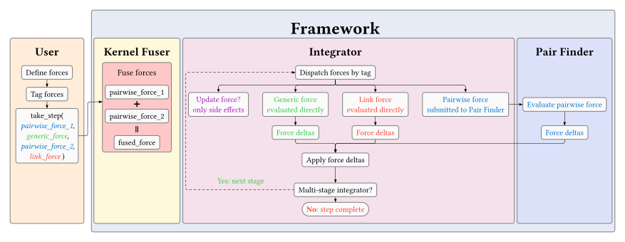

Integrators
===========

Integrators advance the simulation state forward in time by applying accumulated forces to each agent's fields.

TECS provides a base integrator class and two concrete implementations.

The integrator orchestrates all force evaluation during a time step. It dispatches ``GENERIC_FORCE`` and ``UPDATE_FUNC`` kernels over all agents, routes ``PAIRWISE_FORCE`` forces through the configured ``PairFinder`` for neighbour discovery, and runs ``LINK_FORCE`` kernels over the explicit link list.

Default Behaviour
-----------------

The default integrator used by ``DefaultSimulationConfig`` is the Heun method.

The integrator can be selected at compile-time via the simulation configuration:

.. code-block:: cpp

  CREATE_SIMULATION_CONFIG(MySimulationConfig,
    CONFIG_INTEGRATOR(integrators::Heun)
  )

For full API details, see the :doc:`../api/integrators` reference.

Euler Method
------------

The Euler method is the simplest integration scheme. It uses two internal stages:

- **Stage 0**: Current simulation state (e.g. positions)
- **Stage 1**: Force delta buffers

During ``integrate()`` the integrator:

1. Evaluates all forces (generic, pairwise, link) into the stage-1 delta buffers with ``is_full_step = true``
2. Applies the centre-of-mass correction
3. Saves the current velocities to ``old_velocities``
4. Updates each field
5. Clears the delta buffers for the next step

.. math::

  \vec{x}_{n+1} = \vec{x}_n + \Delta t \cdot \dot{\vec{x}}_n

.. code-block:: cpp

  CONFIG_INTEGRATOR(integrators::Euler)

*Pros*: Simple, fast, one force evaluation per step.

*Cons*: First-order accuracy; may require smaller time steps for stability.

Heun Method
-----------

The Heun method (second-order explicit Runge-Kutta) improves accuracy with a predictor-corrector scheme using four internal stages:

- **Stage 0**: Current simulation state (e.g. positions)
- **Stage 1**: First force delta buffers
- **Stage 2**: Predicted state (Euler predictor)
- **Stage 3**: Second force delta buffers

During ``integrate()`` the integrator:

1. Evaluates all forces at the current state into stage 1 with ``is_full_step = true``
2. Applies the centre-of-mass correction to stage 1
3. Computes the Euler predictor into stage 2
4. Evaluates all forces at the predicted state (stage 2) into stage 3 with ``is_full_step = false``
5. Applies the centre-of-mass correction to stage 3
6. Computes the average velocity and saves to ``old_velocities``
7. Updates each field
8. Clears both delta buffers for the next step

.. math::

  \tilde{\vec{x}}_{n+1} &= \vec{x}_n + \Delta t \cdot \dot{\vec{x}}_n \\
  \vec{x}_{n+1} &= \vec{x}_n + \frac{\Delta t}{2} \left( \dot{\vec{x}}_n + \dot{\tilde{\vec{x}}}_{n+1} \right)

.. code-block:: cpp

  CONFIG_INTEGRATOR(integrators::Heun)

*Pros*: Second-order accuracy; better stability.

*Cons*: Two force evaluations per step (predictor + corrector).
